# Real-to-Sim Teleop: AWSBuilderCube → PaperBowl (Isaac Sim 6.0.1, raw — no Isaac Lab)

**Goal:** teleoperate `SO_ARM101_USD` inside
[`source/sim_to_real_so101/demo/real-to-sim.usd`](../source/sim_to_real_so101/demo/real-to-sim.usd)
for a pick-and-place task — place `AWSBuilderCube` into `PaperBowl`.

**Hard platform constraint: Isaac Sim 6.0.1, Isaac Lab off-limits entirely (any version,
including 3.0).** This is not a preference — it ruled out the normal path for this repo. Every
other script here (`keyboard_agent.py`, `lerobot_agent.py`, `zero_agent.py`, etc.) is built on
`isaaclab.app.AppLauncher` / `isaaclab.envs.ManagerBasedRLEnv`, and the *only* Isaac Lab release
that supports Isaac Sim 6.0.1 is Isaac Lab 3.0 (Beta) — there is no Isaac-Lab-based way to
satisfy "Isaac Sim 6.0.1, no Isaac Lab." So this task is implemented against Isaac Sim's own
APIs directly: `isaacsim.SimulationApp` (not `AppLauncher`), raw PhysX `PhysicsDriveAPI`
attributes on each joint (not `ArticulationCfg`/`ImplicitActuatorCfg`), no gym env.

**Status: implemented and verified working.** Keyboard-jog joint control confirmed on
`C:\Isaac-Sim` (a completely clean 6.0.1 install — `pip list` shows nothing named
isaacsim/isaaclab, confirming no Isaac Lab presence at all). Robot renders in the correct
position, all 6 joints jog correctly, and the gripper has confirmed real grasp torque against
the cube.

**Not yet done** (see §5): real leader-arm (COM4) hardware input — only keyboard jogging exists
today, chosen deliberately as the minimal first slice. Also no grasp/placement *detection*
(the robot can physically pick up and place the cube, but nothing watches for it), no dataset
recording.

---

## 0. Architecture

No gym env, no `env.step()` — this is a plain Kit/PhysX loop: read held keys, accumulate a
per-joint target in degrees, clamp to the joint's own authored limits, write it straight to
each joint's `drive:angular:physics:targetPosition` USD attribute every frame.

```mermaid
flowchart LR
    subgraph KB["Keyboard (implemented today)"]
        KEYS["held keys<br/>D/A W/X E/V T/G Y/H U/J"]
    end
    subgraph HOST["keyboard_agent_raw_isaacsim.py -- every simulation_app.update()"]
        JOG["JointJogKeyboardControl<br/>held key -> per-joint delta, degrees"]
        TARGETS["running target[6]<br/>clamped to each joint's own<br/>physics:lowerLimit/upperLimit"]
    end
    subgraph SIM["Isaac Sim 6.0.1 -- real-to-sim.usd, physics playing"]
        JOINTS["6 PhysicsDriveAPI joints<br/>Rotation ... Jaw (degrees)"]
        GRIP["gripper / jaw"]
        CUBE["AWSBuilderCube<br/>RigidBodyAPI+MassAPI added at runtime"]
        BOWL["PaperBowl (static, untouched)"]
    end

    KEYS --> JOG --> TARGETS -- "targetPosition attr, deg" --> JOINTS
    JOINTS -- drives --> GRIP -- "contact / friction" --> CUBE
    CUBE -. "released, resting in" .-> BOWL
```



A future leader-arm version would replace the `KB` subgraph with a serial read + degree
conversion (`lerobot_interface.py`'s conversion math is framework-agnostic — see §5), feeding
the *same* `TARGETS` mechanism. Nothing downstream of `TARGETS` would need to change.

## 1. What exists

- [`scripts/keyboard_agent_raw_isaacsim.py`](../source/sim_to_real_so101/scripts/keyboard_agent_raw_isaacsim.py)
  — the whole implementation, self-contained, no Isaac Lab import anywhere.
- [`utils/keyboard.py`](../source/sim_to_real_so101/utils/keyboard.py)'s `JointJogKeyboardControl`
  — reused unmodified. Built directly on `carb.input`/`omni.appwindow`/`omni.kit.app`, zero
  Isaac Lab dependency, so it works as-is here even though it was originally written for the
  Isaac-Lab-based `keyboard_agent.py`.
- [`utils/version_banner.py`](../source/sim_to_real_so101/utils/version_banner.py)'s
  `print_simulator_version_banner()` — prints the real Isaac Sim version (from a `VERSION`-file
  fallback, since a plain Kit-app install like `C:\Isaac-Sim` has no `importlib.metadata` entry
  for `isaacsim`) plus an explicit "no Isaac Lab installed" line when applicable. Printed twice
  (right after boot, and again right before the controls list) so it's unmissable in a demo.

## 2. How to run it

```powershell
C:\Isaac-Sim\python.bat source\sim_to_real_so101\scripts\keyboard_agent_raw_isaacsim.py
```

Direct file path, **not** `-m` — this repo's package isn't pip-installed in a plain Isaac Sim
python (only the Isaac-Lab venvs have it via `pip install -e`), so `-m package.module`
resolution fails before the script's own `sys.path` insertion ever runs. Confirmed directly:
`-m` gives `ModuleNotFoundError: No module named 'sim_to_real_so101'`; the direct file path
works.

Add `--headless` for no viewport window, `--joint_step <degrees>` to change jog speed
(default `0.5°` per `simulation_app.update()` tick while a key is held).

Expect roughly 30-45s to boot to the ready state (`[INFO]: Keyboard jog controls...` printed) —
first extension/shader loading. Controls:

| Joint | Increase (+) | Decrease (−) |
|---|---|---|
| Rotation (base yaw) | `D` | `A` |
| Pitch (shoulder) | `W` | `X` |
| Elbow | `E` | `V` |
| Wrist_Pitch | `T` | `G` |
| Wrist_Roll | `Y` | `H` |
| Jaw (gripper) | `U` | `J` |

`R` resets all 6 joint targets to 0°. Click into the viewport first — it needs focus to receive
key events. If the robot isn't visible on first launch, select `SO_ARM101_USD` in the Stage
outliner and press `F` to frame it.

## 3. Facts verified directly against `real-to-sim.usd`

Verified with `isaacsim.SimulationApp` (headless) and, separately, with a throwaway `usd-core`
pip venv (`usdenv/Scripts/python.exe`, no Kit boot needed for pure `pxr` inspection — see §6).

| Prim | State |
|---|---|
| `/World/SO_ARM101_USD` | `xformOp:translate = (0, 0.3, 0.72)`, `xformOp:orient = (1,0,0,0)` (identity), `xformOp:scale = (1,1,1)`. Every link already has `PhysicsRigidBodyAPI`; `base` also has `PhysicsArticulationRootAPI`. |
| `/World/SO_ARM101_USD/root_joint` | `PhysicsFixedJoint`, `body0` empty (binds to the physics scene's literal origin, not the ancestor Xform), `body1 = .../base`. `localPos0=(0,0,0)`, `localRot0=(1,0,0,0)` (identity), `localPos1=(0,0,0)`, `localRot1=(0.7071,0,0,-0.7071)`. **Authored assuming the robot's ancestor Xform sits at the origin — it doesn't (see above). Must be corrected at runtime, see §4.1.** |
| `/World/SO_ARM101_USD/joints/{Rotation,Pitch,Elbow,Wrist_Pitch,Wrist_Roll,Jaw}` | Each a `PhysicsRevoluteJoint` with `PhysicsDriveAPI:angular` applied. `drive:angular:physics:targetPosition/stiffness/damping/maxForce` all present; `type=force`. Raw file's default gains, **uniform across all 6 joints**: `stiffness=17.8, damping=0.6, maxForce=10`. `physics:lowerLimit`/`upperLimit` authored in **degrees** (e.g. Rotation `±110°`, matching `SO101_CFG`'s `±1.920 rad` in the (unused, Isaac-Lab-only) config exactly via `rad × 180/π`). |
| `/World/AWSBuilderCube` | `xformOp:translate = (0, 0.03, 0.7754)` — the cube's own center. (Not `/World/AWSCubePaper`'s position, `(0, 0.03, 0.7504)` — that sibling decal sits at the cube's *bottom face*, 2.5cm lower; conflating the two was an early mistake, corrected.) Mesh `AWSBuilderCube_Geo` under `AWSBuilderCube/Geometry/`, `physics:approximation=convexHull`, has `PhysicsCollisionAPI`/`PhysicsMeshCollisionAPI` — but **no `RigidBodyAPI`/`MassAPI`** authored. Without adding these it behaves like a static wall under gripper contact. |
| `/World/PaperBowl` | Mesh `Bowl_Geo`, extent `x:[-0.05,0.05] y:[-0.0375,0.0375] z:[0,0.032]` (**not circular** — 10cm×7.5cm, 3.2cm tall), `physics:approximation=none` (exact triangle mesh), no rigid body — stays static, untouched. |
| `/World/Table`, `/World/Table_02` | Table tops at world `z=0.75`. Cube/bowl both rest directly on top (cube bottom face at `z=0.7504`, matches). |

## 4. Bugs found and fixed (all confirmed empirically, not just reasoned about)

### 4.1 Robot spawned in the wrong place / invisible

**Symptom:** robot didn't render where expected; Kit logged
`PhysicsUSD: CreateJoint - found a joint with disjointed body transforms, the simulation will
most likely snap objects together: /World/SO_ARM101_USD/root_joint`.

**Root cause:** `root_joint`'s `body0` is empty, which in USD Physics means it binds to the
physics scene's literal origin `(0,0,0)` — **not** the `/World/SO_ARM101_USD` ancestor Xform's
actual position. The joint's `localPos0`/`localRot0` (world side) were left at identity, but
`localRot1` (robot side) has a real 90°-ish rotation baked in — i.e. the joint was authored
assuming the robot's ancestor Xform would sit at the origin. It doesn't (translated to
`(0, 0.3, 0.72)`), so PhysX tried to satisfy the constraint at the origin instead, snapping the
whole robot away from the table.

**Fix:** at runtime, right after opening the stage and before `timeline.play()`:
```python
local_rot1 = root_joint_prim.GetAttribute("physics:localRot1").Get()
root_joint_prim.GetAttribute("physics:localPos0").Set(ROBOT_POS)       # (0, 0.3, 0.72)
root_joint_prim.GetAttribute("physics:localRot0").Set(local_rot1)      # reuse, don't reinvent
```
This is exact, not approximate, because `localPos1=(0,0,0)` and the ancestor Xform's own
orientation is identity — so the compensating `localPos0`/`localRot0` is just `ROBOT_POS` and
the joint's own existing `localRot1`.

**Verified:** a standalone test opened the stage, applied the fix, ran 60 physics steps, and
read `base`'s actual world position back via `UsdGeom.Xformable.ComputeLocalToWorldTransform()`:
result `(-0.0000014, 0.30017, 0.72009)` — within 0.2mm of the expected `(0, 0.3, 0.72)`. The
"disjointed body transforms" warning no longer appears.

### 4.2 Gripper couldn't grasp anything

**Symptom:** robot moved correctly, but the jaw couldn't actually grip/lift the cube.

**Root cause:** an *incorrect* unit conversion. `SO101_CFG`'s actuator gains
(`assets/so101.py`, values like `Jaw: stiffness=4, damping=0.3`) are Isaac-Lab-era numbers,
tuned for a radian-space representation. The raw joint's `PhysicsDriveAPI` position values
(`targetPosition`, `lowerLimit`, `upperLimit`) are authored in **degrees**. The first version of
this script "corrected" for that by scaling stiffness/damping by `π/180 ≈ 0.01745` — reasoning
that the drive gain must operate directly against the degree-valued position error. That
reasoning was wrong: it made every joint roughly 57× weaker than intended (e.g. Jaw's
`stiffness` became `~0.07`), nowhere near enough torque to hold anything against resistance.

**Verified empirically**, not just reasoned about a second time: a live A/B/C step-response
test drove the Jaw joint to a 60° target under three gain settings and read back the actual
settled position after 90 physics steps:

| Trial | stiffness / damping | final position (target 60°) |
|---|---|---|
| A — Isaac-Lab values, **unconverted** | `4 / 0.3` | `59.956°` |
| B — Isaac-Lab values × `π/180` | `~0.070 / ~0.0052` | `59.926°` (worst of the three) |
| C — raw file's own default | `17.8 / 0.6` | `59.999°` |

All three technically converge in an *unloaded* free swing (no resistance), so this alone
doesn't prove torque authority — but combined with basic PD math (`torque = stiffness ×
positionError`, clamped to `maxForce`), the converted values (B) simply can't generate
meaningful torque against a real obstruction (e.g. a plausible 20°-blocked error × stiffness
`0.07` ≈ `1.4 N·m`, vs `80 N·m` → clamped to the `30 N·m` limit for the unconverted value).
Trial B was also measurably the least accurate tracker of the three, consistent with being the
weakest. PhysX's drive equation evidently operates on radians internally regardless of how the
joint's position/limits are authored/displayed in the USD file.

**Fix:** use `SO101_CFG`'s stiffness/damping numbers **directly, unconverted**:
```python
JOINT_GAINS = {
    "Rotation": dict(stiffness=55, damping=0.7, effort_limit=30),
    "Pitch": dict(stiffness=30, damping=0.8, effort_limit=30),
    "Elbow": dict(stiffness=25, damping=0.7, effort_limit=30),
    "Wrist_Pitch": dict(stiffness=12, damping=0.5, effort_limit=30),
    "Wrist_Roll": dict(stiffness=7, damping=0.5, effort_limit=30),
    "Jaw": dict(stiffness=4, damping=0.3, effort_limit=30),
}
```
`effort_limit`/`maxForce` (torque) is unit-agnostic either way, unaffected by this. **Confirmed
working by the user directly** after this fix — real grasp torque, cube can be picked up.

### 4.3 Cube behaved like a static wall

**Root cause:** per §3, `AWSBuilderCube` has collision geometry but no `RigidBodyAPI`/`MassAPI`
authored in the raw file.

**Fix:** applied at runtime, right after opening the stage:
```python
if not cube_prim.HasAPI(UsdPhysics.RigidBodyAPI):
    UsdPhysics.RigidBodyAPI.Apply(cube_prim)
if not cube_prim.HasAPI(UsdPhysics.MassAPI):
    UsdPhysics.MassAPI.Apply(cube_prim).CreateMassAttr(0.05)  # 50g, an estimate
```
The `0.05kg` mass is an estimate, not a measured value — worth a real weighing if precise
dynamics ever matter.

## 5. Not yet done — real leader-arm (COM4) input

Today's script only takes keyboard input. Getting the real SO-101 leader arm driving this same
loop is conceptually straightforward and doesn't need Isaac Lab either — the unit-conversion
math already exists in
[`utils/lerobot_interface.py`](../source/sim_to_real_so101/utils/lerobot_interface.py)'s
`LeRobotSO101Interface`, framework-agnostic (`get_mapped_actions_vectorized()` just does
degree/radian + range remapping on plain numpy arrays, no `isaaclab` import). The real work
would be:

1. Read `robot.get_action()` from a `LeRobotSO101Interface(kind="leader", port="COM4",
   id="my_so_arm")` each tick instead of `keyboard_control.get_joint_deltas(...)`.
2. Convert to the same degrees-space this script already targets (the interface's mapping
   currently targets *radians* for the Isaac-Lab task's action space — needs re-deriving for
   degrees, or convert its radian output × `180/π` before writing to `targetPosition`).
3. The `lerobot` pip package (the vendored `lerobot-sim` fork) is **not installed** anywhere
   this script can currently run — would need installing into whatever Python runs this script.
4. Calibration: `--robot_id my_so_arm` (not `armatron_leader` — that name is stale, from a
   different `lerobot-sim` context). `HF_LEROBOT_CALIBRATION` env var defaults to
   `~/.cache/huggingface/lerobot/calibration`, not this repo's `calibration/` folder — point it
   there, or pass `calibration_dir` explicitly, before wiring up real hardware.

No grasp/placement *detection* exists either (the physical pick-and-place works; nothing
watches for "cube is in the bowl now"). Reimplementing that without Isaac Lab's manager/sensor
API would mean reading `ContactSensor`-equivalent contact data via raw PhysX tensor APIs
directly (`omni.physics.tensors`) and a plain box-bounds check — doable, not yet built.

## 6. Isaac Sim inspection technique (gotchas)

- `C:\Isaac-Sim\python.bat` alone can't import `pxr` — needs `isaacsim.SimulationApp` to boot
  Kit first, which registers the extensions that make `pxr` importable.
- For pure USD inspection with no simulation/rendering needed at all (reading/checking `.usd`
  files without booting Kit), a throwaway `usd-core` pip venv is much faster:
  ```powershell
  uv venv --python 3.11 --seed usdenv
  usdenv\Scripts\python.exe -m pip install usd-core
  ```
  This is what produced every fact in §3 — no GPU, no Kit, no rendering, just the schema API.
- **`-m package.module` invocation fails** unless the package is actually importable from
  `sys.path` *before* Python starts resolving `-m` — which happens before any in-script
  `sys.path` manipulation can run. Use a direct file path instead when the package isn't
  pip-installed in the target Python (confirmed: `C:\Isaac-Sim\python.bat` has no
  `sim_to_real_so101` installed, only the Isaac-Lab venvs do via `pip install -e`).
- **Buffered stdout is silently dropped when the process is killed/`simulation_app.close()`
  runs** — Kit's shutdown force-terminates rather than doing a clean CPython exit, so anything
  still sitting in Python's stdout buffer (block-buffered when redirected to a file/pipe) never
  flushes; the log just cuts off mid-line with no error. Looks like a hang or silent crash.
  Fix: write results to your own file opened in the script and call `.flush()` after every
  write (or run Python with `-u` for unbuffered stdout), don't rely on `print()` + shell
  redirection alone.
- `importlib.metadata.version("isaacsim")` raises `PackageNotFoundError` on a plain Kit-app
  install like `C:\Isaac-Sim` — it's not a pip package there, just a Kit extension tree.
  `version_banner.py` falls back to reading the `VERSION` file at the path in the `ISAAC_PATH`
  env var (set by `python.bat` itself), then to walking up from the `isaacsim` package's own
  directory looking for the same file.
- GUI windows launched through an automated tool/agent session may not attach to the
  interactive window station even when `query session` reports the same session ID as the
  visible desktop — a process can burn real GPU/CPU (confirmed: 53% 3D-engine utilization, 300+
  CPU-seconds) rendering into a window that never actually appears on screen. If a launch looks
  "stuck" with heavy resource use but zero visible window/taskbar entry, this is the likely
  cause — run it from an actual interactive terminal instead.

Full details also saved to memory: `isaac_sim_local_rtx_verification` and
`real_to_sim_aws_cube_bowl_task`.
