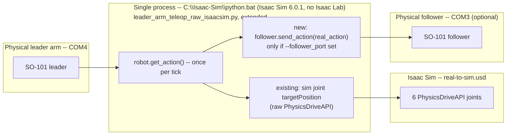

# Dual Teleop: One Leader Arm → Sim + Real Follower (COM3), Single Process

**Goal:** drive the Isaac Sim `SO_ARM101_USD` **and** a real SO-101 follower
arm on `COM3` from the same physical leader arm on `COM4`, at the same time,
in true lockstep — one process, one loop, one read of the leader per tick,
fanned out to both outputs in the same iteration.

**Status: design only, nothing implemented yet.** Written as a waterfall —
each phase is small, independently testable, and is a prerequisite for the
next. Stop and fix a phase before moving on; don't build Phase N+1 on a
Phase N that hasn't actually been verified against real hardware.

**Backward compatible by design:** everything below lives behind a new,
opt-in `--follower_port` flag on the existing script. Unset (today's usual
invocation, no new flags), the script behaves exactly as it does today —
sim-only teleop of `SO_ARM101_USD` from the leader arm, nothing else
changed. The follower-mirroring code only runs at all once `--follower_port`
is explicitly passed.

**Hard platform constraint, unchanged from the base script and carried
through every phase below: Isaac Sim 6.0.1, Isaac Lab off-limits entirely
(any version, including 3.0)** — see
[aws-cube-to-bowl-teleop-plan.md](aws-cube-to-bowl-teleop-plan.md) for why.
Concretely: everything here still runs against raw `isaacsim.SimulationApp`
and raw PhysX `PhysicsDriveAPI` attributes, exactly like
`leader_arm_teleop_raw_isaacsim.py` does today — no `isaaclab.app.AppLauncher`,
no `ArticulationCfg`/`ImplicitActuatorCfg`, no gym env, anywhere in this
plan, including the sim-side grasp-detection work in Phase 4 (which is
exactly the kind of thing Isaac Lab's manager/sensor API would normally
provide, and has to be built against raw PhysX instead, per
[aws-cube-to-bowl-teleop-plan.md §5](aws-cube-to-bowl-teleop-plan.md)). One
upside of the single-process design below: since the follower connection
lives in the *same* Python process as the sim (§ "Why single-process"), it
automatically runs under the same constrained interpreter
(`C:\Isaac-Sim\python.bat`, no Isaac Lab) — there's no second environment to
separately keep off Isaac Lab.

**Why single-process, not two processes with IPC:** an earlier draft of
this plan used a second process talking to Process A over a local socket,
specifically to decouple the real follower's timing/failure domain from
Kit's render loop. That directly worked against "run synchronously" (the
follower would track the leader on its own timer, not the same tick as sim)
and added real complexity — a bidirectional protocol, reconnect logic, a
message-staleness gap — for a first version that hadn't validated the core
idea yet. Single-process, single-loop, single leader-read is what
"synchronous" actually means here. Phase 2's exit criteria is the one place
this could send the plan back to that design — flagged there, not before.

---

## 0. The one hard constraint (serial ports)

A serial port can only be opened by one process. Since `COM4` (leader) can
only be read from one place, and sim + real follower need to be in lockstep
anyway, the only design that satisfies both is: **read the leader once per
tick, from one process, and fan that single reading out to both sim and the
real follower in the same iteration.**

---

## Phase 0 — Preconditions (no code)

Catch calibration/hardware problems before they're entangled with the sim
script.

- Confirm `calibration/robots/so_follower/my_so_arm.json` (not the `.bak`/
  `.drifted_8190` siblings next to it) is the calibration actually intended
  for the physical arm that will sit on `COM3` — the drifted-backup name
  suggests this arm's calibration may have needed re-verification before.
- Standalone smoke test, no Isaac Sim involved: connect to the follower on
  `COM3` via `LeRobotSO101Interface(device="cuda",kind="follower", port="COM3", id="my_so_arm")`
  in a throwaway script/REPL, call `get_observation()`, confirm it returns
  sane joint positions. This isolates "is COM3/the follower/its calibration
  OK" from "does the sim integration work." Doesn't need to run under
  `C:\Isaac-Sim\python.bat` specifically — any Python with the vendored
  `lerobot` fork installed works for this isolated check.

**Exit criteria:** follower connects and reports plausible joint positions,
independent of Isaac Sim.

---

## Phase 1 — Minimal mirror, no error handling, no grasp detection

The smallest change that proves the core idea.

**Changes** (recommended: extend `leader_arm_teleop_raw_isaacsim.py` in
place behind the new opt-in `--follower_port` flag, default unset = today's
unchanged sim-only behavior — not a new forked script. Reasoning: this file
already carries hard-won, empirically-tuned state, `JOINT_GAINS`, friction
materials, the `root_joint` fix, per
[aws-cube-to-bowl-teleop-plan.md §4](aws-cube-to-bowl-teleop-plan.md) — a
second near-identical script copy would duplicate all of it with no
mechanism to stay in sync):

1. New CLI flags: `--follower_port` (unset = sim-only, today's behavior),
   `--follower_robot_id` (default `my_so_arm`).
2. Connect a second
   `LeRobotSO101Interface(device="cuda", port=args_cli.follower_port, id=args_cli.follower_robot_id, cameras={}, fps=30, kind="follower")`
   once before the main loop, right next to where the leader interface
   connects today (source/sim_to_real_so101/scripts/leader_arm_teleop_raw_isaacsim.py:246-263),
   but only if `--follower_port` was given. `device="cuda"`, not `"cpu"` —
   this machine is an NVIDIA laptop, so use the GPU it actually has. (Note
   the *existing* leader interface a few lines above still constructs with
   `device="cpu"` today, unchanged by this plan — worth a follow-up look
   separately, but out of scope here. Also note: the raw pass-through in
   step 3 below never actually calls
   `get_raw_actions_tensor()`/`get_mapped_actions_vectorized()` for the
   follower, so `device` has no effect on this specific path yet — it's set
   correctly now so it's already right if Phase 3/4's grasp-signal work
   ends up using any tensor ops on this interface later.)
3. In the loop, right after the existing
   `real_action = robot_iface.robot.get_action()` and the existing sim-target
   write (source/sim_to_real_so101/scripts/leader_arm_teleop_raw_isaacsim.py:280-294):
   if `--follower_port` was given, call
   `follower_iface.robot.send_action(real_action)` with the **same raw
   dict**, unmodified — no unit conversion needed. `real_action` is already
   in the native lerobot key space (`{"shoulder_pan.pos": ..., ...,
   "gripper.pos": ...}`) that a real follower's `send_action()` expects
   directly. The `get_raw_actions_tensor()` → `get_mapped_actions_vectorized()`
   → degrees/radians pipeline that follows exists only to target the sim
   articulation's degree-authored `PhysicsDriveAPI` attributes and is
   irrelevant here — this matches plain lerobot leader→follower teleop
   (`follower.send_action(leader.get_action())`, no conversion).
4. Deliberately no try/except around `send_action()` yet, no failure
   handling — let it crash loudly if something's wrong. Robustness is
   Phase 2, once the happy path is proven.

**Exit criteria:** with the physical leader arm at a safe neutral pose
before starting (first-connect snap — the follower jumps straight to the
leader's current position the instant sending begins, no ramp, same as
plain lerobot teleop), run with `--follower_port COM3` and confirm the real
follower visibly tracks the leader correctly *at the same time* as the sim
viewport, for a few minutes of normal jogging, without crashing. Separately,
confirm running with no `--follower_port` at all still behaves exactly like
the unmodified script today.

---

## Phase 2 — Make Phase 1 robust and measure its real cost

Only start this once Phase 1's happy path is proven.

**Changes:**

1. Wrap `follower_iface.robot.send_action(...)` in try/except: log once on
   first failure, then stop calling it for the rest of the run (no per-tick
   error spam) and keep the sim loop running normally. The follower mirror
   must never be able to take the sim demo down with it — contrast with the
   leader-connection failure a few lines above
   (source/sim_to_real_so101/scripts/leader_arm_teleop_raw_isaacsim.py:280-284),
   which correctly `break`s, since no leader input means nothing to
   simulate at all.
2. **Measure, don't assume, the cost of putting a synchronous serial write
   on Kit's clock.** `send_action()` is a blocking write to `COM3`, called
   from the same loop that also calls `simulation_app.update()` every tick
   — unlike a decoupled-process design, this can directly steal frame time
   from Kit's render loop. Feetech bus writes for 6 motors are typically a
   few milliseconds, probably fine at Kit's frame budget, but that's a
   guess. Log `send_action()`'s wall-clock time and compare Kit's own frame
   time/viewport smoothness with `--follower_port` set vs. unset.

**Exit criteria:**
- Unplugging/powering off the real follower mid-run produces one clear log
  line and the sim keeps running normally — no crash, no per-tick spam.
- `send_action()` timing is measured and recorded. **If it's materially
  slowing Kit down**, that's the signal to fall back to a two-process/IPC
  design (§ intro) — a known escape hatch, not something to build
  preemptively. If it's negligible, proceed to Phase 3 as-is.

---

## Phase 3 — Grasp detection, real side only

Build and validate this in isolation before touching sim-side detection or
combining anything.

`SO101Follower.get_observation()` (`lerobot-sim/src/lerobot/robots/so_follower/so_follower.py:218`)
only calls `self.bus.sync_read("Present_Position")` today. The Feetech
control table (`lerobot-sim/src/lerobot/motors/feetech/tables.py`) does
define `Present_Load` (addr 60) / `Present_Current` (addr 69) as read-only
registers, but neither is wired in or used anywhere in this repo yet.

**Changes:**

1. **Commanded-vs-actual gripper position gap** (core signal, no new API
   surface — `send_action()`'s return value plus `get_observation()`'s
   existing `Present_Position` is enough). If the leader-mirrored command
   has the gripper near fully closed but the follower's actual `gripper.pos`
   stalls open by more than a threshold for several consecutive ticks,
   something is blocking the jaws.
2. *(Stretch, only after (1) works)* **Load/current threshold** via a
   direct `follower_iface.robot.bus.sync_read("Present_Load")` call —
   stronger evidence if it correlates with (1), but unverified on this
   hardware until tried.

**Exit criteria:** with the sim/follower mirror running (or even
standalone, follower only, no leader/sim needed for this test), hand-hold
the real follower's gripper closed on the real cube and confirm the
position-gap signal fires; confirm it does *not* false-positive on an empty
close. Numeric thresholds are derived empirically here against the real
cube/arm — don't guess them up front.

---

## Phase 4 — Grasp detection, sim side only

Independent of Phase 3 — validate standalone (jog the sim gripper closed on
`AWSBuilderCube` with no leader/follower involved) before combining.

The script only ever *writes* `targetPosition` today; reading back the
*simulated, achieved* joint angle is new — and, per the platform constraint
above, has to be done against raw PhysX/USD directly, not any Isaac Lab
sensor/manager API. Two candidate techniques — verify empirically which one
actually returns a live value in this raw (no `ArticulationView`) setup
before committing, matching this repo's own precedent of a first guess
about drive-gain units turning out wrong until tested (see
[aws-cube-to-bowl-teleop-plan.md §4.2](aws-cube-to-bowl-teleop-plan.md)):

1. Compute the Jaw joint's actual angle from the live world transforms of
   its parent/child links (`UsdGeom.Xformable.ComputeLocalToWorldTransform`)
   — PhysX reliably writes rigid-body world transforms back to USD every
   tick regardless of other settings, so try this first.
2. Fallback: `omni.physics.tensors`/articulation-view DOF-position query, if
   populated for this raw setup.

With actual joint angle in hand, apply the same commanded-vs-actual gap
heuristic from Phase 3(1) to the Jaw joint — a structurally comparable
signal to the real side, which is what makes Phase 5's side-by-side
comparison meaningful. (Sim also has a strictly higher-fidelity option —
ground-truth cube pose plus PhysX contact-force reporting, flagged as
future work in
[aws-cube-to-bowl-teleop-plan.md §5](aws-cube-to-bowl-teleop-plan.md) — out
of scope here since it has no real-world analog and isn't needed for the
side-by-side comparison.)

**Exit criteria:** jog the sim gripper closed on `AWSBuilderCube` in
isolation and confirm the signal fires; confirm no false-positive on an
empty close.

---

## Phase 5 — Combine and validate together

Only once Phases 3 and 4 each independently work.

**Changes:** print/log both grasp signals from inside the same loop when
either changes (e.g. `[SIM] grasp=True`, `[REAL] grasp=True`) — being one
process, this needs no protocol design, just two print statements next to
each other.

**Exit criteria:** run the full Phase 1+2 mirror with both grasp signals
live, actually pick up the real cube and the sim cube in the same session,
and confirm both signals fire within the same rough window of time. This is
the first point where "sim and real agree on grasp state" is actually
demonstrated, not just assumed from the two independent phase tests above.

---

## Deferred / out of scope

- **Two-process/IPC redesign** — only revisit if Phase 2's timing
  measurement shows `send_action()` materially hurting Kit's frame rate.
  Don't build preemptively.
- **Real-world object pose mirroring** (cube + bowl placement/movement) —
  now has its own full plan:
  [object-pose-mirroring-plan.md](object-pose-mirroring-plan.md). Uses the
  top camera (separate from the wrist camera) + `cv2.aruco` fiducial
  markers + a one-time camera-to-world extrinsic calibration, kinematically
  puppeting `AWSBuilderCube`/`PaperBowl` in sim from the tracked real pose
  every tick — the object-level analog of this plan's arm mirror.

---

## Reference: open items carried through the phases above

- Phase 0: confirm the right follower calibration file.
- Phase 1: existing leader interface still uses `device="cpu"`
  (unchanged) while the new follower interface uses `device="cuda"` — an
  inconsistency worth a separate look, not part of this plan.
- Phase 2: measured `send_action()`/Kit-frame-time cost — the one result
  that could send this plan back to a two-process design.
- Phase 3: whether `Present_Load`/`Present_Current` behave usefully on this
  hardware — unverified until tried.
- Phase 4: which joint-state read technique actually returns a live
  simulated value in this raw setup — needs a quick empirical check, not an
  assumption.
