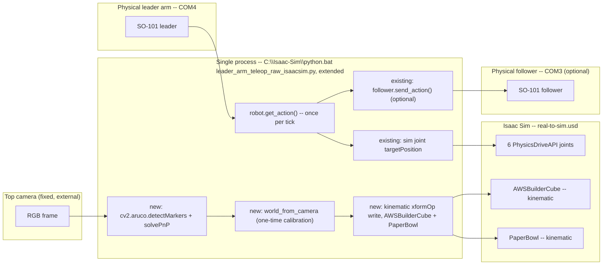

# Real-to-Sim Object Pose Mirroring: AWSBuilderCube + PaperBowl (Top Camera + ArUco)

**Goal:** while `leader_arm_teleop_raw_isaacsim.py` runs, continuously mirror
the *real-world* pose of the physical `AWSBuilderCube` and `PaperBowl` into
their corresponding Isaac Sim prims every tick — so when a human moves the
real cube (or nudges the real bowl) during a teleop session, the sim
viewport shows the same placement and movement in lockstep, the same way
[dual-teleop-sim-and-follower-plan.md](dual-teleop-sim-and-follower-plan.md)
already mirrors the arm.

**Status: design only, nothing implemented yet.** Same waterfall structure
as the dual-teleop plan — each phase is small, independently testable, and
a prerequisite for the next.

**Key difference from the arm mirror:** the arm's sim and real-follower
copies are both *driven* from the same leader-arm reading — there's no
sensing involved, just fan-out of one command stream. There is no
equivalent "actuator" for the cube's pose: a human's hand moves it, not a
motor sim can command. The only way to mirror it is to *observe* the real
object (camera + fiducial markers) and impose that observed pose onto the
sim prim. This is a one-directional, perception-driven mirror, not a
fan-out of a shared command.

**Design decision (confirmed with the user): full kinematic puppet.** The
sim `AWSBuilderCube`'s pose is fully overridden every tick by the
camera-tracked real pose, exactly like the follower arm mirrors the leader
— not a hybrid that only resyncs when the sim gripper isn't in contact, and
not a separate non-physical "ghost" copy. Trade-off, accepted explicitly:
the sim gripper's grasp-physics tuning that already exists in this repo
(friction materials, `JOINT_GAINS["Jaw"]` effort limit) stops determining
where the cube visually sits — the cube will visually track the real world
regardless of what the sim gripper's fingers are doing. See Phase 2 for how
kinematic mode is applied without losing collision *response* entirely.

**Camera hardware: a top-mounted external camera already exists** (fixed
view of the workspace), separate from the robot's wrist camera. This plan
uses **only the top camera** — it has a stable, unmoving extrinsic once
calibrated, unlike the wrist camera which moves with the gripper every
tick. The wrist camera is listed under Deferred below.

**Dependency: already satisfied, verified 2026-08-18 — nothing to
install.** `C:\Isaac-Sim\python.bat` already has `opencv-contrib` with
`cv2.aruco` available (`cv2.aruco.ArucoDetector`,
`cv2.aruco.getPredefinedDictionary` both present; confirmed by direct
import, not assumed). The `pip install opencv-contrib-python` step
originally planned here turned out to be unnecessary.

---

## 0. Data flow

---

## Phase 0 — Preconditions: markers, intrinsics, one-time extrinsic calibration

No sim code yet. Catches marker/camera/measurement problems before they're
entangled with the sim script, matching Phase 0 of the dual-teleop plan.

- **Marker choice:** `cv2.aruco.DICT_4X4_50`, one printed marker per object,
  distinct ids (e.g. `cube_id=0`, `bowl_id=1`). Measure and record the
  printed marker's exact physical side length in meters — required for
  `solvePnP` scale, and wrong by even a few mm will bias every downstream
  pose. **Generator script written and verified end-to-end 2026-08-18:**
  `scripts/generate_aruco_markers.py` (ids 0 and 1 by default) — uses
  `cv2.aruco.generateImageMarker`, not the deprecated `drawMarker` (which
  doesn't exist in this OpenCV build). Round-tripped through
  `marker_tracking.detect_markers` to confirm each generated image is
  actually detectable and identifies as the right id, not just that the
  image file gets written. Embeds print DPI via Pillow so "print at
  100%/actual size" targets 5cm by default (matching the cube's own side
  length) — but the script itself insists, and this doc repeats: **measure
  the printed marker afterward and use that number, not the target,** for
  `--marker_size_m` everywhere else.
- **Cube marker placement — needs the physical cube in hand, not decidable
  from USD alone.** `AWSBuilderCube` already has decorated faces (AWS
  Builder Loft text, logo, pixel art — see
  [aws-builder-cube.md](aws-builder-cube.md)). The marker needs a face that
  (a) stays visible to the top camera while the cube is resting on the
  table, and (b) is flat enough for reliable detection. Decide whether that
  means printing a marker on a currently-blank face, or affixing a small
  physical tag over/beside existing art — a real-world decision, flag it
  rather than guessing.
- **Bowl marker placement:** on the bowl's rim or an outward-facing side
  face, since `PaperBowl`'s extent (`10cm x 7.5cm x 3.2cm`, per
  [[real_to_sim_aws_cube_bowl_task]]) is short and a top-face marker would
  be occluded whenever anything is inside it.
- **Camera intrinsics calibration** (standard, one-time per physical
  camera): `cv2.calibrateCamera` against a printed checkerboard, save `K`
  and distortion coefficients to a new `calibration/camera/top_camera_intrinsics.json`
  — new subfolder alongside this repo's existing `calibration/robots/` and
  `calibration/teleoperators/`, same convention. **Script written
  2026-08-18:** `scripts/calibrate_camera_intrinsics.py` — console-only
  (no `cv2.imshow`, Isaac Sim's `cv2` build has no GUI backend at all,
  verified), auto-captures a sample whenever a checkerboard is detected
  and enough time has passed since the last one. Smoke-tested (`--help`,
  syntax) but not yet run against a real checkerboard.
- **Real/sim cube size mismatch, found 2026-08-18: the real cube is 5.7cm,
  `real-to-sim.usd` authors a 5cm cube.** This matters for calibration, not
  just marker sizing — `AWSBuilderCube`'s authored position `(0, 0.03,
  0.7754)` is its *center*, i.e. table-surface-height + half of the
  *assumed* 5cm, so using it directly as "place the marker flat here" is
  wrong on two counts (a flat marker can't float at center-height with
  nothing under it, and the height offset itself assumes the wrong cube
  size). **Corrected approach, now what `calibrate_camera_extrinsics.py`
  actually defaults to:** place the calibration marker flat on *top* of
  the real physical cube, resting at its normal spot — table-surface-Z
  (`0.7504`, from `AWSCubePaper`'s authored position, itself independent
  of assumed cube height) plus the *real* measured cube height (`0.057`),
  giving `world_pos = (0, 0.03, 0.8074)`. Overridable via `--world_pos` if
  your cube's actual height differs.
- **Camera extrinsics calibration (camera → world):** place a marker at one
  precisely-measured point in the *same world frame `real-to-sim.usd`
  already authors* (see the size-mismatch note just above for exactly
  where). One `solvePnP` against that single observation
  yields `world_from_camera`; cache it to
  `calibration/camera/top_camera_extrinsics.json`. This is a **one-time
  step per camera mounting** — redo it if the camera is ever bumped or
  remounted. **Script written 2026-08-18:** `scripts/calibrate_camera_extrinsics.py`
  — defaults `--world_pos` to the cube's authored rest position so the
  natural workflow is "place the calibration marker where the cube
  normally sits"; averages position across `--num_samples` detections,
  reports spread as a quality check. Smoke-tested (fails fast correctly
  when intrinsics aren't calibrated yet) but not yet run against a real
  marker.
- **Sanity check:** with the real cube sitting at its normal rest position,
  confirm the computed world pose is within a few mm of the *marker's own*
  expected position — **not** `(0, 0.03, 0.7754)`, the sim's cube-center
  assumption, which is both the wrong reference point (center, not
  wherever the marker physically sits) and based on the wrong 5cm cube
  size. If the cube's tracking marker ends up on the top face (same
  placement used for extrinsic calibration above), the expected value is
  `(0, 0.03, 0.8074)`; if it ends up on a side face instead, recompute
  using that face's actual offset from the cube's center and the real
  5.7cm dimensions, not the value here.

**Exit criteria:** `solvePnP` reprojection error under ~2px on the
calibration marker; the static sanity check above passes within a few mm.
**Status: both scripts ready to run, exit criteria not yet attempted** —
needs the physical marker/checkerboard/camera mount, which only the user
can do.

### Note: the marker vs. an existing trained SmolVLA policy (out-of-distribution risk)

**Problem, raised 2026-08-18:** a SmolVLA policy already trained on real
demonstrations of the *undecorated-with-a-tag* cube may treat the ArUco
marker as an out-of-distribution visual input if it appears in whatever
camera feed the policy consumes at inference — the pixel keys fed to any
`lerobot` policy are exactly the `cameras` dict passed into
`LeRobotSO101Interface` (`utils/lerobot_interface.py:96-110`), i.e. whatever
cameras were present at the *original* demonstration-collection time, not
something this pipeline controls. **Hard constraint: no time to teleoperate
new demonstrations**, so any fix must not require new physical data
collection. Priority-ordered mitigations, cheapest first:

1. **Test empirically before building anything.** Put the tag on the real
   cube, run the existing checkpoint, watch for actual degradation before
   assuming it's a problem — matches this repo's established
   "verify against real hardware, don't assume" precedent (see
   [[isaac_sim_local_rtx_verification]]). Note this policy has *already*
   shown a real OOD-shaped failure once: the 2026-07-28 sanity run in
   `so101-lerobot/SmolVLA_training_report.md` stalled 11-51s before moving,
   traced to objects in the top-camera view absent from the demonstrations
   — the same class of problem a newly-added marker risks reproducing, so
   treat this as a real risk to test for, not a hypothetical one.
2. ~~Free fix: keep the tag out of the policy's camera view entirely~~ —
   **checked, does not apply.** `so101-lerobot/SmolVLA_training_report.md`
   §1 confirms the checkpoint was trained on **both** `gripper_cam` *and*
   `top_cam` (wide-angle USB, index 1) — the same physical top camera this
   plan's Phase 0 mounts the tracking marker in front of. Camera separation
   can't be used to dodge this for free; go straight to mitigation 3.
3. **The tag is unavoidably in the policy's view: mask/inpaint it at
   inference time, don't retrain.** Phase 1 below already builds a
   `cv2.aruco` detector that finds the marker's pixel bounding box every
   frame for tracking purposes — reuse that exact detector output to
   overpaint the marker region (`cv2.inpaint`, or a flat fill sampled from
   the surrounding cube texture) in the frame *before* it's handed to the
   policy. Near-zero extra cost since the detector already exists for
   tracking; needs no new data or training run. **This is now the primary
   mitigation, not a fallback**, given (2) is ruled out.
4. **Cheap, stackable with (3): minimize the tag's footprint/exposure.**
   Smallest reliably-detectable marker size, placed on the
   least-camera-visible face/corner rather than a dominant face.
5. **Last resort, only if (1) shows real degradation and (3) isn't clean
   enough: augment the *existing* recorded dataset, not new
   teleoperation.** Synthetically composite a rendered ArUco pattern onto
   the cube region of already-recorded demonstration frames (classical
   image compositing, no new physical demos), then do a short/cheap
   finetune (e.g. LoRA) from the current checkpoint on the augmented
   variant. Time cost is compute, not teleop time, so it fits the stated
   constraint — but it's the most engineering-heavy option, so it's
   ordered behind (1)-(4).

---

## Phase 1 — Marker detection + pose readback, camera-only, no sim

**Status: code written 2026-08-18, not yet exit-criteria-verified** (needs
Phase 0's physical calibration files, which don't exist yet — the code
itself is done and unit-tested where it can be without hardware).

Isolate "does tracking work" from "does sim integration work," same
isolation principle as the dual-teleop plan's Phase 0.

- `source/sim_to_real_so101/utils/marker_tracking.py` — pure `cv2`/`numpy`
  helpers (`detect_markers`, `solve_marker_pose_camera_frame`,
  `marker_pose_to_world`, `load_camera_calibration`), **no
  `isaacsim`/`omni` import**, matching `geometry.py`'s existing "isaac-free,
  unit-testable" convention. This module's `detect_markers` output is also
  what the SmolVLA-masking mitigation above (Phase 0, mitigation 3) would
  reuse at inference time — same detector, two consumers.
  - Uses `cv2.aruco.ArucoDetector` + manual `solvePnP`, not
    `cv2.aruco.estimatePoseSingleMarkers` — that convenience function
    **does not exist** in the OpenCV build on this machine (4.13.0,
    verified against both `C:\Isaac-Sim\python.bat` and `so101-lerobot`'s
    venv), so this isn't a style choice, it's the only option that works
    here.
  - The world-frame quaternion conversion (`_rotation_matrix_to_quat_wxyz`,
    full 4-branch Shepperd's method for numerical stability near 180°
    rotations) was verified against `scipy.spatial.transform.Rotation`
    across 5 test rotations (identity, single-axis, compound) — exact
    match, not just spot-checked by eye.
  - `C:\Isaac-Sim\python.bat` already has `cv2.aruco` available (verified
    2026-08-18) — the plan's original "install opencv-contrib-python"
    prerequisite for Phase 2 is already satisfied, nothing to install.
- `source/sim_to_real_so101/scripts/track_objects_standalone.py` — opens
  the top camera, prints live cube/bowl world poses to the console. No
  Isaac Sim involved. Fails fast with a clear message if Phase 0's
  `calibration/camera/top_camera_{intrinsics,extrinsics}.json` don't exist
  yet (confirmed via smoke test — clean exit 1, not a crash), matching
  `leader_arm_teleop_raw_isaacsim.py`'s existing fail-fast-on-missing-file
  pattern.

**Exit criteria (not yet run — needs Phase 0 first):** move the real cube
around by hand; printed world pose tracks it smoothly, in correct
real-world units and orientation. Temporarily covering the marker with a
hand produces a graceful "no detection this frame" (last-known-pose or
explicit `None`), never a crash or a garbage/NaN pose.

---

## Phase 2 — Integrate into `leader_arm_teleop_raw_isaacsim.py`, cube only

**Status: written 2026-08-18.** All 5 changes below are implemented and
smoke-tested (syntax, `--help`, both new fail-fast paths — missing
`--marker_size_m`, missing calibration files — confirmed instant-exit
before Kit boots). One implementation detail discovered only by directly
inspecting the stage rather than assuming: `AWSBuilderCube` authors *only*
`xformOp:translate` (`double3`) — no `xformOp:orient` at all, unlike
`PaperBowl` which has translate+orient+scale. The Phase 2 code adds an
orient op (`AddOrientOp()`, float/`quatf` precision, matching
`PaperBowl`'s own convention) before the first tick when `--track_camera`
is set. Not yet run against real hardware — needs Phase 0's calibration
files, which don't exist yet.

**Changes** (opt-in, backward compatible — new flag `--track_camera`
default `None`/unset = today's unchanged behavior, matching how
`--follower_port` was added):

1. When `--track_camera` is given: open the top camera, load the Phase 0
   intrinsics/extrinsics files.
2. **Kinematic, not dynamic-with-gravity, for the tracked cube.** Instead of
   today's `UsdPhysics.RigidBodyAPI` + `MassAPI` (fully dynamic — see
   `leader_arm_teleop_raw_isaacsim.py:222-225`), additionally set
   `physics:kinematicEnabled = true` on the rigid body when
   `--track_camera` is set. A kinematic rigid body still participates in
   PhysX collision *response on other bodies* (the sim gripper's pads won't
   clip through it, other dynamic objects still bounce off it) but its own
   pose is driven externally every tick instead of being force-integrated
   — exactly the property this puppet needs.
3. Each tick, right alongside the existing joint-target write: run
   detection, transform to world frame, and set the cube's xformOp
   translate/orient from the tracked pose — same pattern already used for
   `ROBOT_POS`/`root_joint` (`leader_arm_teleop_raw_isaacsim.py:256-258`).
4. **Marker-not-visible fallback:** if detection fails this frame (e.g. the
   gripper occludes the marker mid-grasp — the single most likely moment
   for exactly that to happen), hold the last known good pose rather than
   snapping to origin or writing a NaN transform.
5. `'R'` reset behavior for the cube stops being meaningful once it's
   camera-driven (software can't move the real object). When
   `--track_camera` is set, skip `restore_prim_pose` for the cube
   specifically and print a one-line note; leave the bowl's reset behavior
   as-is until Phase 3 folds it into tracking too.

**Exit criteria:** with `--track_camera` set, move the real cube by hand
across the table; the sim cube visually follows within a tick or two,
holds steady through a brief occlusion, and resumes on re-detection.
Confirm omitting `--track_camera` leaves today's dynamic/grippable/resettable
cube behavior completely unchanged. Separately, jog the sim gripper closed
around the (now kinematic) cube and confirm it looks visually plausible —
flagged as a real open question in "Reference" below, not assumed to look
right just because collision response still runs.

---

## Phase 3 — Bowl tracking, combined cube + bowl mirroring

- Extend Phase 2's mechanism to `PaperBowl` with its own marker id.
  `PaperBowl` today has no physics at all (fully static mesh-collision-only
  prim, per [[real_to_sim_aws_cube_bowl_task]]) — no `kinematicEnabled`
  toggle needed, just write its xformOps directly from the tracked pose
  each tick, same as the cube.
- Confirm two-marker-per-frame detection doesn't misattribute ids (bowl
  marker read as the cube's, or vice versa) and doesn't add material
  per-tick cost over single-marker detection.

**Exit criteria:** nudge the real bowl by hand; the sim bowl reflects the
new position. Cube and bowl track independently and simultaneously with no
cross-talk, in the same run as Phase 2's cube-only test.

---

## Phase 4 — Latency/robustness measurement

Only start once Phase 2+3's happy path is proven, matching the rigor of
the dual-teleop plan's Phase 2 (which measured, rather than assumed, the
real follower's serial-write cost).

- Log camera-grab + `detectMarkers` + `solvePnP` wall-clock time per tick,
  periodic summary (not per-tick spam), same style as the existing
  tick/`send_action` stats block
  (`leader_arm_teleop_raw_isaacsim.py:394-409`).
- **If material**, move camera capture to a background thread (grab
  continuously, main loop reads the latest available frame non-blocking)
  so a slow frame grab can't stall Kit's render loop — don't build this
  preemptively, only if measurement shows it's needed.

**Exit criteria:** camera+detection overhead is measured and logged; if
material, moved off the main thread and re-measured to confirm it no
longer steals frame time from Kit.

---

## Deferred / out of scope

- **Wrist camera as a secondary/occlusion-recovery view.** Only the top
  camera is used for v1. The wrist camera moves with the gripper every
  tick, so tracking off it would need a per-frame extrinsic (gripper pose →
  camera pose → world), not a one-time calibration like the top camera —
  materially bigger lift. Worth revisiting only if top-camera occlusion
  during real grasps turns out to be a frequent practical problem.
- **RealSense depth/point-cloud tracking.** This plan only needs an RGB
  stream for ArUco detection; a RealSense's RGB stream works identically to
  a plain webcam here. Depth-based pose refinement is a possible future
  upgrade, not required.
- **Real-world placement success detection** (cube resting inside the
  bowl's footprint) — this plan happens to make it possible as a side
  effect (both objects now have known real-world poses every tick, so the
  existing local-frame box-bounds check pattern in
  [[real_to_sim_aws_cube_bowl_task]] could run on real coordinates too),
  but scoring/labeling "placed" is separate follow-on work, not built here.
- **Dataset-augmentation + finetune fallback for the SmolVLA OOD
  mitigation** (Phase 0 note, mitigation 5) — only pursued if
  inference-time inpainting (now the primary mitigation, camera separation
  having been ruled out) proves insufficient; not built preemptively.

---

## Reference: open items carried through the phases above

- Phase 0: exact physical marker placement on the cube — needs the
  physical object in hand to decide, not decidable from USD/photos alone.
  Which camera(s) the checkpoint trained on is now resolved (both
  `gripper_cam` and `top_cam`, see the OOD note above) — the remaining open
  item is locating/rebuilding an actual runnable checkpoint to test
  mitigation 3 against: the main `smolvla_so101_pick_cube` run
  (W&B `o1ngsm6o`) has no local `outputs/` directory in this copy of
  `so101-lerobot` (git-ignored, likely only ever existed on the training
  machine) and no corresponding pushed Hub model repo — only its holdout
  sibling, `aakashv100/smolvla_so101_pick_cube_holdout`, is confirmed
  present and loadable on the Hub.
- Phase 2: whether a kinematic cube visually meshes with the sim gripper
  closing around it, or looks like clipping since contact forces no longer
  affect the cube's own pose — verify empirically before calling this
  phase done, don't assume it looks right.
- Phase 3: two-marker-per-frame detection cost and id cross-talk — measure,
  don't assume.
- Phase 4: camera-thread interaction with Kit's own threading model —
  verify empirically, matching this repo's established "verify against
  real hardware/render" precedent (see [[isaac_sim_local_rtx_verification]]).
